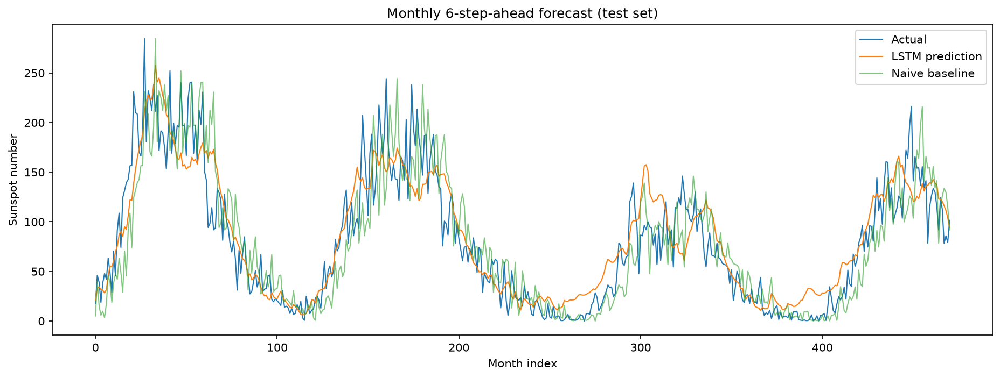

# Sunspot Time Series Forecasting with an LSTM

A deep learning project that forecasts the sunspot number using a Recurrent Neural
Network (LSTM), built from scratch in PyTorch. The project goes beyond a single model:
it benchmarks the LSTM against a naive baseline and reframes the forecasting task to
demonstrate where a learned model actually adds value.

## Overview

The full pipeline — data cleaning, preprocessing, model design, training and evaluation —
is implemented in PyTorch and documented across three Jupyter notebooks. The workflow
covers chronological train/test splitting, leakage-free normalization, sliding-window
sequence generation, multi-step forecasting, and rigorous evaluation against a naive
baseline.

## Key Result

| Task | Naive baseline RMSE | LSTM RMSE | Improvement |
|------|--------------------:|----------:|------------:|
| Daily, 1-step-ahead       | 15.12 | 15.30 | −1.2% (baseline wins) |
| Monthly, 6-steps-ahead    | 34.87 | 29.10 | **+16.5%** |

On noisy **one-step daily** forecasting, a naive "tomorrow = today" baseline is extremely
hard to beat — the last value already contains most of the signal. By reframing the task
to **monthly aggregation** (exposing the ~11-year solar cycle) and **multi-step forecasting**
(where persistence breaks down), the LSTM beats the appropriate baseline by **16.5%**,
showing it has learned real temporal structure.

## Dataset

- **Source:** [SILSO – Daily total sunspot number](https://www.sidc.be/SILSO/datafiles)
- **Range:** 1818-01-01 to 2026-05-31 (~76,000 daily records)
- **Format:** semicolon-separated, 8 columns
  (year, month, day, decimal date, sunspot number, std. deviation,
  number of observations, definitive/provisional flag)
- **Missing values:** marked as `-1` (~3,200 records, mostly early years),
  removed during preprocessing.

> **Note:** The dataset is **not** included in this repository (the `data/`
> folder is git-ignored). Download `SN_d_tot_V2.0.csv` from SILSO and place it
> in the `data/` folder before running the notebooks.

## Method

1. **Cleaning** – remove missing values (`-1`), reset the index.
2. **Split** – chronological 80/20 train/test split (no shuffling of the time
   axis, to avoid data leakage).
3. **Normalization** – Min-Max scaling to [0, 1]; min/max computed on the
   **training data only** and applied to the test data.
4. **Windowing** – sliding window: past N steps as input, the value H steps
   ahead as the target.
5. **Model** – single-layer LSTM followed by a linear layer that maps the last
   time step to one output value.
6. **Evaluation** – RMSE in real units, compared against a naive persistence baseline.

## Results

### Daily forecast vs. actual (notebook 02)


### Monthly multi-step forecast vs. actual and baseline (notebook 03)


The LSTM captures the solar cycle and clearly outperforms the naive baseline on the
multi-step task.

## Project Structure

```
sunspot-lstm-forecasting/
├── data/                # Dataset (not tracked – add the CSV here)
├── notebooks/
│   ├── 01_data_exploration.ipynb         # Loading, cleaning, visualization
│   ├── 02_preprocessing_and_model.ipynb  # Daily 1-step model + baseline comparison
│   └── 03_monthly_multistep.ipynb        # Monthly multi-step model that beats the baseline
├── models/              # Saved trained models (.pth)
├── figures/             # Saved evaluation plots
├── pyproject.toml       # Dependencies (uv)
├── uv.lock              # Locked dependency versions
└── README.md
```

## How to Run

This project uses [uv](https://docs.astral.sh/uv/) for environment management.

1. **Clone the repository**

```bash
git clone https://github.com/nanare-sudo/sunspot-lstm-forecasting.git
cd sunspot-lstm-forecasting
```

2. **Add the dataset** — download `SN_d_tot_V2.0.csv` from
   [SILSO](https://www.sidc.be/SILSO/datafiles) and place it in the `data/` folder.

3. **Install the environment**

```bash
uv sync
```

4. **Launch Jupyter**

```bash
uv run jupyter lab
```

5. **Run the notebooks** in order (01 → 02 → 03).

## Tech Stack

Python · PyTorch · pandas · NumPy · Matplotlib · uv

## Possible Improvements

- Tune the forecast horizon and window size.
- Compare LSTM vs. GRU vs. vanilla RNN architectures.
- Extend to sequence-to-sequence forecasting of the full cycle.