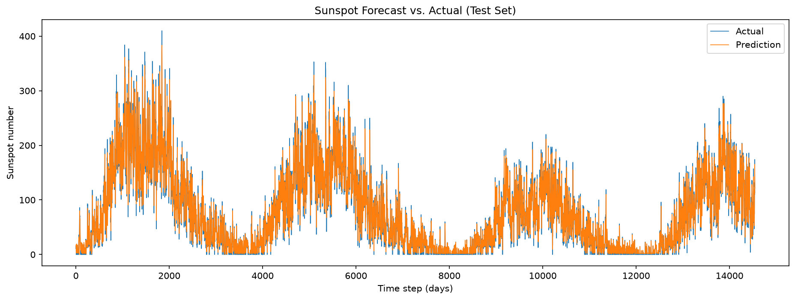
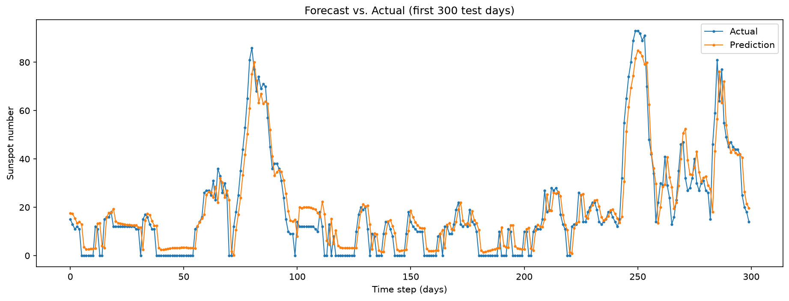

# dl-a2-2533110 — Time Series Forecasting of Sunspot Activity with an LSTM

Assignment 2 (Deep Learning) — forecasting the daily total sunspot number with a
recurrent neural network (LSTM) implemented in PyTorch.

## Overview

This project trains an LSTM to predict the **next day's** sunspot number from the
**previous 30 days**. The full pipeline — data cleaning, preprocessing, model
definition, training, and evaluation — is documented step by step in two Jupyter
notebooks. The trained model reaches an **RMSE of ≈ 15.3 sunspots** on a held-out
test set covering roughly the last 40 years of the record.

## Dataset

**Daily total sunspot number** from the SILSO World Data Center
(file: `SN_d_tot_V2.0.csv`).

- Period: **1818 – 2026**, ~76,000 daily records
- Format: semicolon-separated (`;`), **no header row**, 8 columns:
  `year; month; day; decimal_date; sunspots; std_dev; n_observations; definitive`
- The target variable is the **`sunspots`** column.
- Missing measurements are encoded as **`-1`** (3,247 rows). These are removed
  during preprocessing, leaving **72,875 valid daily values**.

> The dataset is **not** included in this repository (the `data/` folder is
> git-ignored). Download `SN_d_tot_V2.0.csv` from the SILSO sunspot data files
> and place it in the `data/` folder before running the notebooks.

## Project Structure

```
dl-a2-2533110/
├── data/                 # raw dataset (not tracked in Git — add the CSV here)
├── notebooks/
│   ├── 01_data_exploration.ipynb      # loading, cleaning, visual inspection
│   └── 02_preprocessing_and_model.ipynb  # preprocessing, model, training, evaluation
├── models/
│   └── sunspot_lstm.pth  # trained model weights (state_dict)
├── figures/              # exported evaluation plots
├── scripts/              # (unused — all code lives in the notebooks)
├── pyproject.toml        # environment / dependencies (managed with uv)
├── uv.lock               # exact pinned dependency versions
├── .gitignore
└── README.md
```

## Setup & How to Run

This project uses [**uv**](https://docs.astral.sh/uv/) for environment and
package management.

1. **Clone the repository**
   ```bash
   git clone https://git.uni-wuppertal.de/2533110/dl-a2-2533110.git
   cd dl-a2-2533110
   ```

2. **Add the dataset**
   Download `SN_d_tot_V2.0.csv` and place it in the `data/` folder.

3. **Install the environment**
   ```bash
   uv sync
   ```

4. **Launch Jupyter and run the notebooks in order**
   ```bash
   uv run jupyter lab
   ```
   Open and run `01_data_exploration.ipynb` first, then
   `02_preprocessing_and_model.ipynb` (Run → Run All Cells). Each notebook is
   self-contained and reloads the data from `data/`.


## Results

- **RMSE:** ≈ 15.3 sunspots on the test set

The model tracks the multi-year solar cycles well across the entire test period.
Sharp daily peaks are slightly underestimated — the model favors a smoother fit
that keeps the average error low, which is expected for noisy daily data.




## Possible Improvements

- Tune hyperparameters (window size, `hidden_size`, number of layers, epochs).
- Try a GRU or a stacked / bidirectional architecture.

## Author

Leonardo Berisha — Student ID 2533110