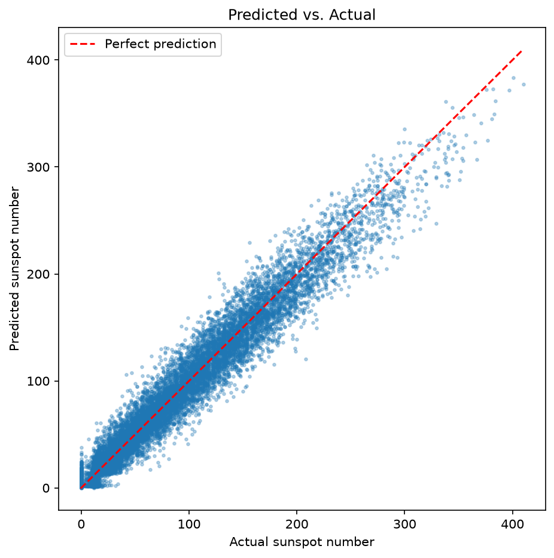

# Sunspot Time Series Forecasting with an LSTM

A deep learning project that forecasts the daily total sunspot number using a
Recurrent Neural Network (LSTM), built from scratch in PyTorch. Given the
sunspot values of the past 30 days, the model predicts the value of the next day.

## Overview

The full pipeline – data cleaning, preprocessing, model design, training and
evaluation – is implemented in PyTorch and documented in Jupyter notebooks.
The project demonstrates a complete time series forecasting workflow, including
chronological train/test splitting, leakage-free normalization, sliding-window
sequence generation, and model evaluation with multiple metrics and plots.

## Dataset

- **Source:** https://www.sidc.be/SILSO/datafiles
- **Range:** 1818-01-01 to 2026-05-31 (~76,000 daily records)
- **Format:** semicolon-separated, 8 columns
  (year, month, day, decimal date, sunspot number, std. deviation,
  number of observations, definitive/provisional flag)
- **Missing values:** marked as `-1` (~3,200 records, mostly early years),
  removed during preprocessing.

> **Note:** The dataset is **not** included in this repository (the `data/`
> folder is git-ignored). Download `SN_d_tot_V2.0.csv` from SILSO and place it
> in the `data/` folder before running the notebooks.

## Method

1. **Cleaning** – remove missing values (`-1`), reset the index.
2. **Split** – chronological 80/20 train/test split (no shuffling of the time
   axis, to avoid data leakage).
3. **Normalization** – Min-Max scaling to [0, 1]; min/max computed on the
   **training data only** and applied to the test data.
4. **Windowing** – sliding window of length 30: the past 30 days are the input,
   the next day is the target.
5. **Model** – single-layer LSTM (`hidden_size=50`) followed by a linear layer
   that maps the last time step to one output value.
6. **Training** – MSE loss, Adam optimizer (`lr=0.001`), batch size 64, 10 epochs.

## Results

- **RMSE:** ~15.3 sunspots on the unseen test set.
- The model captures the ~11-year solar cycle across the whole test period.
- Sharp daily peaks are slightly underestimated (the model smooths extremes),
  which is expected for noisy daily data.

### Forecast vs. Actual (full test set)


### Zoom – first 300 test days


### Predicted vs. Actual


## Project Structure

```
sunspot-lstm-forecasting/
├── data/                # Dataset (not tracked – add the CSV here)
├── notebooks/
│   ├── 01_data_exploration.ipynb         # Loading, cleaning, visualization
│   └── 02_preprocessing_and_model.ipynb  # Preprocessing, model, training, evaluation
├── models/              # Saved trained model (sunspot_lstm.pth)
├── figures/             # Saved evaluation plots
├── pyproject.toml       # Dependencies (uv)
├── uv.lock              # Locked dependency versions
└── README.md
```

## How to Run

This project uses [uv](https://docs.astral.sh/uv/) for environment management.

1. **Clone the repository**
```bash
   git clone https://github.com/nanare-sudo/sunspot-lstm-forecasting.git
   cd sunspot-lstm-forecasting
```

2. **Add the dataset**
   Download `SN_d_tot_V2.0.csv` from [SILSO](https://www.sidc.be/SILSO/datafiles)
   and place it in the `data/` folder.

3. **Install the environment**
```bash
   uv sync
```

4. **Launch Jupyter**
```bash
   uv run jupyter lab
```

5. **Run the notebooks** in order:
   - `01_data_exploration.ipynb`
   - `02_preprocessing_and_model.ipynb`

## Tech Stack

Python · PyTorch · pandas · NumPy · Matplotlib · uv

## Possible Improvements

- Tune hyperparameters (window size, hidden size, number of layers, epochs).
- Compare LSTM vs. GRU vs. vanilla RNN architectures.
- Aggregate to monthly means for a smoother, less noisy signal.

### Baseline Comparison

A naive persistence baseline (predicting that tomorrow equals today) achieves
an RMSE of **15.12**, slightly *better* than the LSTM (**15.30**). This is a
known characteristic of one-step-ahead forecasting on noisy daily series: the
last observed value is already a very strong predictor, and the naive baseline
is notoriously hard to beat. The result highlights the importance of comparing
any model against a trivial benchmark rather than judging it by its loss alone.